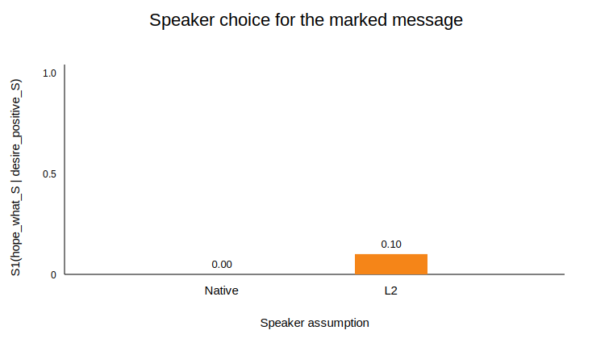
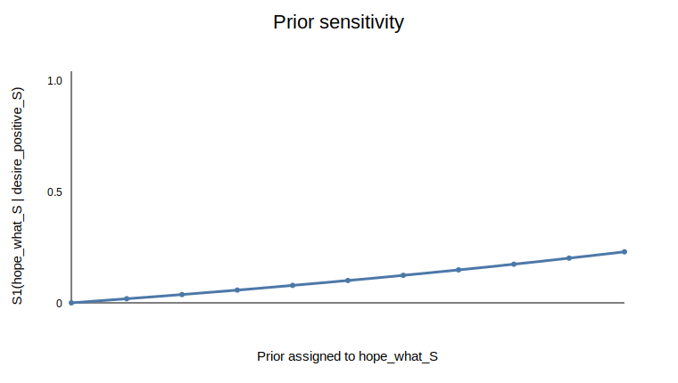

# RSA hope-wh modeling notes

This repository grew out of coursework on cognitive models of human language understanding. I am using it as a small research notebook for practicing how to turn a linguistic observation into a simple computational model.

The example I focus on is a marked sentence frame such as `I hope what will happen`. In standard English, `hope` usually takes a declarative complement, while predicates such as `wonder` more naturally take embedded wh-clauses. The model asks a narrow question: if a listener thinks the speaker is an L2 English speaker, does that change how likely the listener thinks the speaker would be to produce the marked utterance?

## Current model

The project uses a minimal Rational Speech Act (RSA) setup:

- objects/states: whether the speaker has a positive desire about an event or is mainly uncertain about it
- messages: `hope_that_S_good`, `wonder_what_S`, and the marked `hope_what_S`
- costs: how difficult or marked a message is assumed to be
- message priors: how likely a speaker is to use each message before the listener reasons about the specific state

The current version is intentionally modest. It is a toy model for exploring assumptions, not a claim about the full grammar of embedded wh-clauses.

## Baseline result

With the current deterministic truth table, the strongest visible effect of the native vs. L2 assumption is in the pragmatic speaker distribution: `S1(hope_what_S | desire_positive_S)`. In plainer terms, the model asks how likely a speaker would be to choose the marked message when they want a positive outcome.



In the current parameter setting, the marked message is almost unused under the native-speaker assumption (`0.0001`) but more available under the L2-speaker assumption (`0.1004`). These numbers are not meant as empirical estimates; they are a check that the toy model moves in the expected direction.

The cost sweep shows that the marked message becomes less likely as its cost increases.


The prior sweep shows that the marked message becomes more likely as its message prior increases.



## Repository structure

```text
.
├── README.md
├── requirements.txt
├── figures/
├── notebooks/
│   └── RSA_Non_Veridical_L2.ipynb
├── notes/
│   ├── literature.md
│   └── study_design.md
├── scripts/
│   └── make_figures.py
├── src/
│   ├── hope_wh_scenario.py
│   └── rsa_model.py
└── tests/
    └── test_rsa_model.py
```

## How to run

```bash
python -m pip install -r requirements.txt
pytest
python scripts/make_figures.py
```

The model code and figure script use only the Python standard library. The notebook uses `matplotlib` for interactive plotting.

## Current limitations

- The costs and message priors are hand-set rather than estimated from data.
- The marked `hope_what_S` form is represented with a very simple meaning assumption.
- There is not yet acceptability or interpretation judgment data.
- The current truth table is deterministic, so listener interpretations are less informative than speaker-choice probabilities in this first version.
- The model currently uses one main construction, so it should be extended to related predicates before drawing broader conclusions.

## Next steps

- Compare `hope`, `fear`, `wonder`, and `know` in the same message set.
- Add a small synthetic judgment-data example to show how costs could be estimated.
- Turn the study sketch into a small pilot judgment task.
- Replace hand-set costs and priors with values motivated by reading notes or pilot data.
