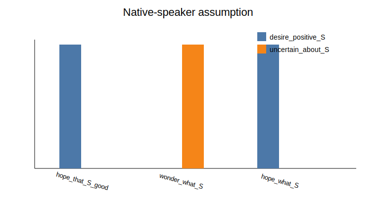
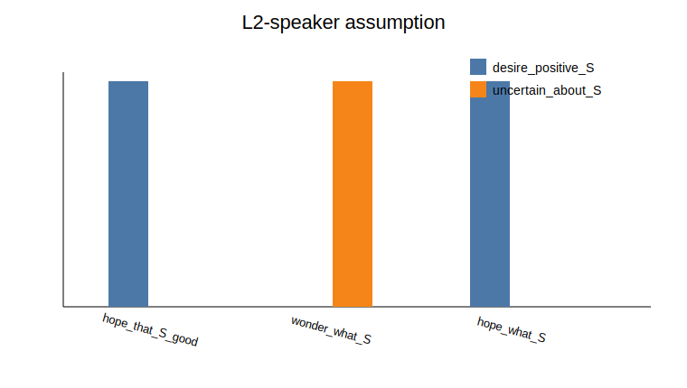
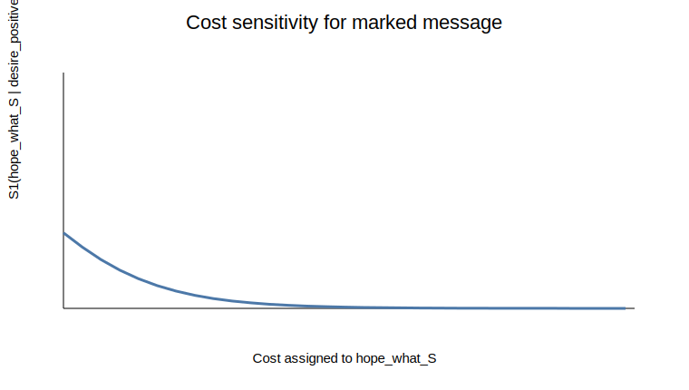

# RSA hope-wh modeling notes

This repository grew out of coursework on cognitive models of human language understanding. I am using it as a small research notebook for practicing how to turn a linguistic observation into a simple computational model.

The example I focus on is a marked sentence frame such as `I hope what will happen`. In standard English, `hope` usually takes a declarative complement, while predicates such as `wonder` more naturally take embedded wh-clauses. The model asks a narrow question: if a listener thinks the speaker is an L2 English speaker, does that change how the listener interprets the marked utterance?

## Current model

The project uses a minimal Rational Speech Act (RSA) setup:

- objects/states: whether the speaker has a positive desire about an event or is mainly uncertain about it
- messages: `hope_that_S_good`, `wonder_what_S`, and the marked `hope_what_S`
- costs: how difficult or marked a message is assumed to be
- message priors: how likely a speaker is to use each message before the listener reasons about the specific state

The current version is intentionally modest. It is a toy model for exploring assumptions, not a claim about the full grammar of embedded wh-clauses.

## Baseline result

Under a native-speaker assumption, the marked message receives a high cost and a low prior.



Under an L2-speaker assumption, the marked message is treated as less surprising.



The cost sweep shows how speaker production of the marked message changes as its cost increases.



## Repository structure

```text
.
├── README.md
├── requirements.txt
├── figures/
├── notebooks/
│   └── RSA_Non_Veridical_L2.ipynb
├── notes/
│   ├── literature.md
│   └── study_design.md
├── src/
│   └── rsa_model.py
└── tests/
    └── test_rsa_model.py
```

## How to run

```bash
python -m pip install -r requirements.txt
pytest
```

To regenerate the figures, open and run `notebooks/RSA_Non_Veridical_L2.ipynb` from the repository root.

## Current limitations

- The costs and message priors are hand-set rather than estimated from data.
- The marked `hope_what_S` form is represented with a very simple meaning assumption.
- There is not yet acceptability or interpretation judgment data.
- The model currently uses one main construction, so it should be extended to related predicates before drawing broader conclusions.

## Next steps

- Add a prior-sensitivity sweep alongside the cost sweep.
- Expand the notes on embedded wh-clauses and preferential predicates.
- Turn the study sketch into a small pilot judgment task.
- Try synthetic judgment data to show how costs might be estimated before collecting real data.
